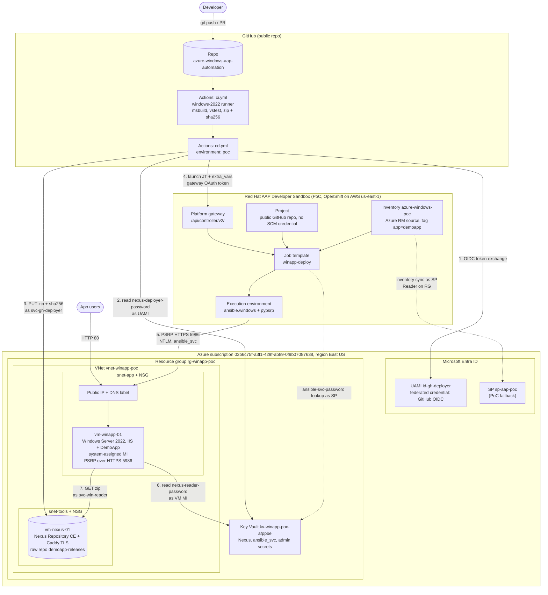
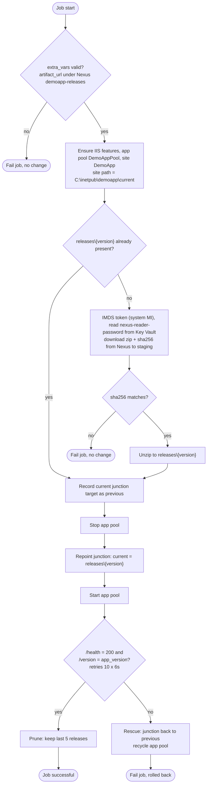
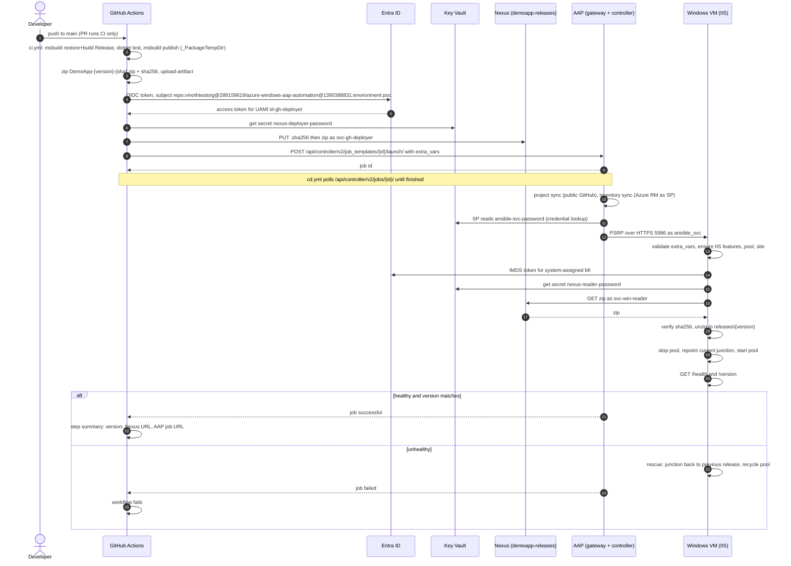
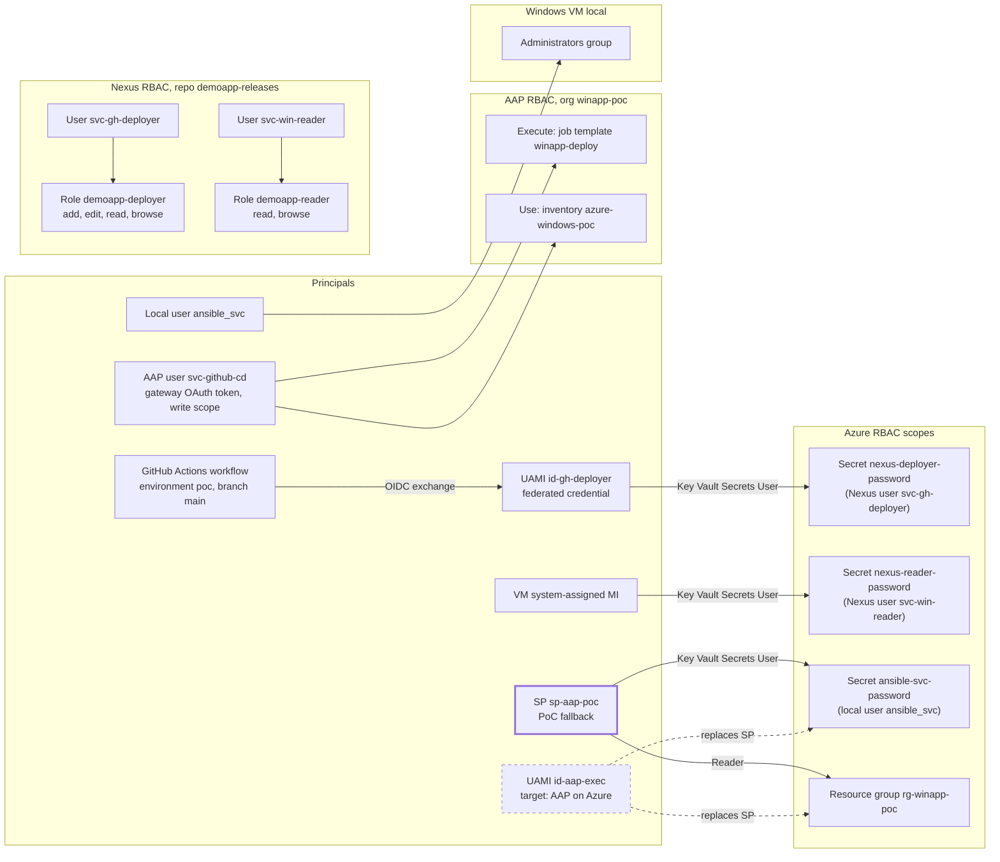
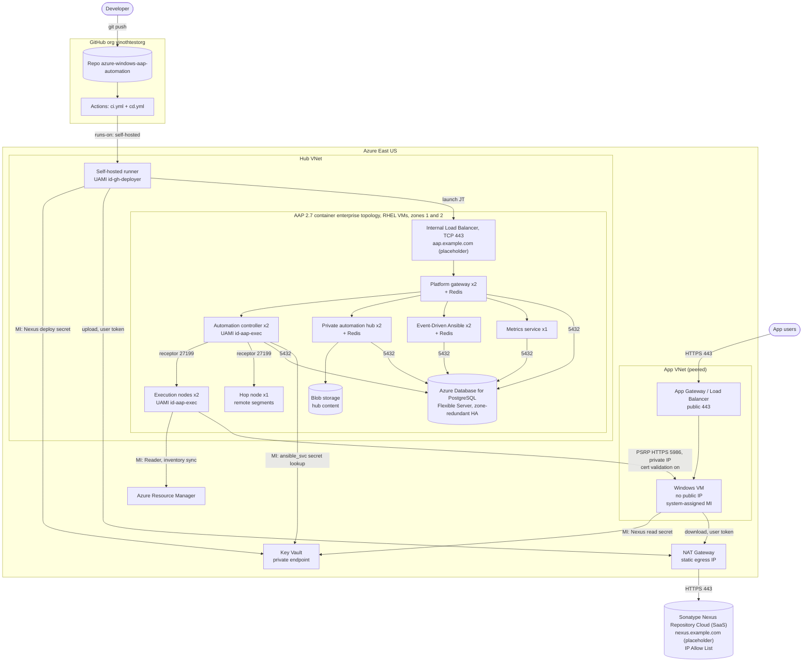

# High-Level Design: .NET Framework App CD on Azure Windows VM with Ansible Automation Platform

| | |
|---|---|
| Status | Draft v0.4 (PoC) |
| Date | 2026-09-27 |
| Repository | [vinothtestorg/azure-windows-aap-automation](https://github.com/vinothtestorg/azure-windows-aap-automation) (public) |
| Azure subscription | `03b6c75f-a3f1-429f-ab89-0f9b07087638` |
| Azure region | East US (`eastus`) |
| Source requirement | [requirement/requirement.md](../requirement/requirement.md) |

**Change log**

| Version | Change |
|---|---|
| v0.1 | First draft. Azure Blob as artifact store. |
| v0.2 | Sonatype Nexus Repository replaces Azure Blob. Nexus passwords held in Key Vault and read through managed identity. Region set to East US. AAP 2.7 alignment: all API calls through the platform gateway, PSRP instead of the legacy WinRM plugin, REST launch instead of `awx` CLI, `ansible.platform` for config-as-code. Public repo, so no AAP SCM credential. Internet exposure of 5986 accepted for the PoC. Review answers recorded in [14.3](#143-resolved-review-questions). |
| v0.3 | GitHub org `vinothtestorg` set in the federated credential subject and project URL. PoC Nexus demo URL fixed on the Azure VM DNS name, Community Edition latest stable. Target state uses Red Hat's AAP 2.7 container enterprise topology on RHEL VMs in Azure. The Key Vault lookup's managed identity support is confirmed in the upstream plugin source. |
| v0.4 | Live sandbox checked: AAP 2.7 (controller 4.8.8), gateway in AWS `us-east-1`, so East US is confirmed. Sandbox facts recorded (default EE, container group, Azure credential fields). Target state: enterprise AAP and RHEL subscriptions already exist, and the organisation Nexus is Sonatype Nexus Repository Cloud (SaaS). Target URLs are dummy placeholders ([13.4](#134-target-placeholders)). |

---

## 1. Purpose and scope

This document describes the design for building, hosting and continuously deploying a .NET Framework 4.7.2 web application to a Windows Server VM in Azure. GitHub Actions does CI. Red Hat Ansible Automation Platform (AAP) does CD. Sonatype Nexus Repository stores the build artifacts. Access to Azure uses managed identity (MI) wherever the runtime allows it, with a service principal (SP) as the fallback.

**In scope**

- Sample ASP.NET MVC app (.NET Framework 4.7.2) hosted on IIS.
- Azure infrastructure for one PoC environment, defined in Bicep.
- A PoC-only Nexus Repository Community Edition instance on Azure, because the organisation Nexus is not available to the PoC.
- One manual first deployment to prove the VM can host the app.
- AAP connectivity to the VM, inventory, credentials and a CD job template.
- GitHub Actions CI, and a CD stage that publishes the artifact to Nexus and launches the AAP job template.
- Identity and RBAC for every hop (GitHub, AAP, Azure, Nexus, VM).
- Target-state design for moving AAP into Azure and using the organisation Nexus.

**Out of scope for the PoC**

- High availability, scale-out, load balancing.
- Databases or app-level secrets.
- Active Directory domain join (local accounts only).
- Production TLS certificate for the app (HTTP only).
- Central monitoring stack.
- Backup of PoC resources. Everything is decommissioned after the PoC succeeds.

## 2. Requirement traceability

| # | Requirement | Design section | Repository artifact |
|---|---|---|---|
| R1 | Build a .NET Framework 4.7.2 app | [5.1](#51-application) | `src/DemoApp`, `src/DemoApp.Tests` |
| R2 | Create a Windows VM in Azure | [5.2](#52-azure-infrastructure) | `infra/bicep/` |
| R3 | Deploy the app to the VM manually | [11.3](#113-first-manual-deployment-r3), [15](#15-delivery-phases) | `docs/runbooks/manual-deploy.md` |
| R4 | Connect the VM to AAP | [5.4](#54-ansible-automation-platform), [8](#8-network-and-connectivity) | `infra/bicep/scripts/configure-remoting.ps1`, `aap/` |
| R5 | Add the VM to inventory | [5.4](#54-ansible-automation-platform) | `aap/vars/poc.yml`, `ansible/inventories/poc/` |
| R6 | Ansible job template for CD | [5.4](#54-ansible-automation-platform), [5.5](#55-ansible-deployment-playbook) | `ansible/playbooks/deploy.yml`, `aap/` |
| R7 | CI with GitHub Actions | [5.6](#56-ci-github-actions) | `.github/workflows/ci.yml` |
| R8 | Call the CD job template from GitHub Actions with the artifact | [5.7](#57-cd-trigger-github-actions-to-aap), [6](#6-end-to-end-cicd-flow) | `.github/workflows/cd.yml` |
| R9 | Validate the job template and workflow | [12](#12-observability-and-validation) | `docs/runbooks/validation.md` |
| R10 | CD design diagram | [4](#4-solution-overview), [6](#6-end-to-end-cicd-flow), [13](#13-target-state-aap-on-azure) | `docs/diagrams/` |
| R11 | MI-based RBAC for Ansible trigger and run, SP as fallback | [7](#7-identity-and-rbac) | `infra/bicep/modules/identity.bicep`, `infra/bicep/modules/secret-reader.bicep`, `infra/scripts/create-aap-sp.sh` |

| # | Definition of Done | Evidence |
|---|---|---|
| D1 | Working .NET Framework 4.7.2 app | CI green, `/health` returns 200 |
| D2 | VM hosting the app (manual) | Browser hit on the VM DNS name after manual deploy |
| D3 | Ansible inventory and connection for the VM | AAP inventory sync lists the VM, `winapp-ping` job succeeds |
| D4 | Ansible job template for CD | `winapp-deploy` job succeeds, `/version` shows the new build |
| D5 | GitHub Actions CI then CD calling AAP | Push to `main` produces a successful AAP job linked from the run summary |
| D6 | CD infra and workflow design diagram | This document and `docs/diagrams/` |
| D7 | Ansible RBAC with MI / SP | Key Vault secret-scoped role assignments in Bicep (`secret-reader.bicep`); the SP's own Reader/Key-Vault-Secrets-User role assignments are created by `infra/scripts/create-aap-sp.sh` (idempotent `az role assignment create`, outside Bicep - the SP itself is created outside Bicep too, see [5.2](#52-azure-infrastructure)); negative tests in [12.2](#122-validation-plan-r9) |

## 3. Assumptions and constraints

| ID | Assumption / constraint | Impact if wrong |
|---|---|---|
| A1 | PoC AAP is the Red Hat AAP Developer Sandbox: a 30-day trial hosted by Red Hat on a shared OpenShift cluster. **Verified 2026-09-27:** the sandbox gateway (`*.apps.rm3.7wse.p1.openshiftapps.com`) resolves to an AWS EC2 address in `us-east-1`. | AAP is outside Azure, so it cannot use Azure MI. The AAP-to-Azure hop uses an SP. See [7](#7-identity-and-rbac). |
| A2 | **Verified 2026-09-27:** the sandbox runs AAP 2.7 (gateway ping `version: 2.7`, automation controller 4.8.8). All API calls go through the platform gateway (`<gateway>/api/controller/v2/`). | None. The design targets 2.7. |
| A3 | The sandbox gateway API is reachable from GitHub-hosted runners over the internet. | Would need a self-hosted runner that can reach AAP. |
| A4 | The sandbox can reach Azure public IPs on 443 and 5986. The 5986 rule is open to the internet (K1, accepted). | Blocks R4. |
| A5 | Sandbox limits: 30-day lifetime, and pods are deleted after 12 consecutive hours of running. | AAP objects are defined as code so they can be recreated in a fresh sandbox. |
| A6 | The deploying engineer has Owner or User Access Administrator on the subscription and can create an Entra app registration. | A subscription admin creates the SP and role assignments. |
| A7 | One environment (`poc`), one app VM, GitHub-hosted runners. | Multi-environment layout is described but not built. |
| A8 | The app has no database and no secrets. | Would add Key Vault references and config transforms. |
| A9 | The organisation Nexus is Sonatype Nexus Repository Cloud (SaaS), already purchased but not used by the PoC. The PoC runs its own Nexus CE. | The implementation changes the artifact URL and the two Key Vault secrets. Pipeline and playbook stay the same. |

## 4. Solution overview

A developer pushes to `main`. GitHub Actions builds and tests the app on a Windows runner, then packages it as a versioned zip with a SHA-256 checksum. It signs in to Azure through OIDC federation as a user-assigned managed identity, reads the Nexus deployer password from Key Vault, and uploads the package to the Nexus raw repository `demoapp-releases`. It then launches the AAP job template `winapp-deploy` through the AAP platform gateway, passing the version, artifact URL and checksum.

AAP connects to the VM with PSRP over HTTPS. The playbook runs on the VM. It uses the VM's own system-assigned managed identity to read the Nexus reader password from Key Vault. It then downloads the package from Nexus, verifies the checksum, unpacks it into a new release folder, switches IIS to it, and checks health. If the health check fails, it rolls back to the previous release. GitHub Actions polls the AAP job and fails the workflow if the job fails.



*Source: [01-architecture-poc.mmd](diagrams/01-architecture-poc.mmd) · Rendered: [01-architecture-poc.svg](diagrams/01-architecture-poc.svg)*

**Key properties**

- No Azure secret is stored in GitHub. GitHub signs in to Azure through OIDC federation.
- No Nexus password is stored in GitHub, AAP or on the VM disk. Each consumer reads its own Nexus password from Key Vault at run time, using a managed identity that can read only that one secret.
- The only long-lived secret outside Key Vault is the AAP SP client secret. It lives only in AAP and is removed in the target state.
- Playbooks, job template and CI stay the same when AAP moves into Azure and the organisation Nexus replaces the PoC Nexus. Only credentials, URLs and network paths change.

## 5. Component design

### 5.1 Application

| Item | Design |
|---|---|
| Type | ASP.NET MVC 5 web application, target framework .NET Framework 4.7.2 |
| Projects | `src/DemoApp` (web), `src/DemoApp.Tests` (MSTest or NUnit), `DemoApp.sln` |
| Endpoints | `/` home page. `/health` returns HTTP 200 with JSON `{"status":"ok"}`. `/version` returns the build version and git SHA. |
| Version stamping | CI writes the version (`1.0.<run_number>`) and short SHA into a `version.json` file in the package, which `/version` and `deployments.log` both read (as-built: no `AssemblyInformationalVersion` stamping - see [15.1](#151-as-built-2026-09-28)). |
| Runtime | Windows Server 2022 ships .NET Framework 4.8, which runs 4.7.2-targeted apps in place. No runtime install needed. |
| Build | Windows only (MSBuild with web publish targets). Developers on macOS rely on CI to build. The `Microsoft.NETFramework.ReferenceAssemblies` NuGet package pins the 4.7.2 reference assemblies, so the build does not depend on the runner image's targeting packs. |

### 5.2 Azure infrastructure

Defined in Bicep under `infra/bicep/` (`main.bicep`, `main.bicepparam`, modules `network`, `keyvault`, `identity`, `secret-reader`, `vm-windows`, `vm-nexus`). Deployed with `az deployment group create` at resource group scope. The resource group itself is created with `az group create`. There is no `rbac` module: Key Vault secret-scoped role assignments are inlined per-secret via `secret-reader.bicep`, and the `sp-aap-poc` service principal's own role assignments are created outside Bicep by `infra/scripts/create-aap-sp.sh` (Entra app/SP objects need the Graph extension, which plain Bicep at this API surface does not have - see [7](#7-identity-and-rbac)).

**Region: East US (verified).** The sandbox gateway resolves to an AWS EC2 address in `us-east-1` (Northern Virginia). Azure East US is also in Virginia, so it is the closest Azure region. PSRP makes several round trips per task, so latency to AAP directly affects job time. East Asia would add about 200 ms to every round trip.

| Resource | Name (PoC) | Key settings |
|---|---|---|
| Resource group | `rg-winapp-poc` | East US. Tags `app=demoapp`, `env=poc`. |
| Virtual network | `vnet-winapp-poc` | Subnets `snet-app` (app VM) and `snet-tools` (Nexus). |
| Network security groups | `nsg-winapp-app`, `nsg-winapp-tools` | Inbound rules in [8](#8-network-and-connectivity). Deny all else. |
| Public IPs | `pip-winapp-vm`, `pip-nexus` | Standard SKU, static, DNS labels. PoC only. |
| App VM | `vm-winapp-01` | Windows Server 2022 Datacenter Azure Edition, `Standard_D2as_v7` with `diskControllerType: NVMe` (as-built: `Standard_B2ms` and every other common B-/D-series size were `NotAvailableForSubscription` on this Free Trial subscription - see [15.1](#151-as-built-2026-09-28)), Premium SSD. Tag `app=demoapp`. System-assigned MI. Automatic OS patching. |
| App VM extension | `Microsoft.Compute/virtualMachines/runCommands` (as-built: Run Command, not a Custom Script Extension - see [15.1](#151-as-built-2026-09-28)) | Runs `configure-remoting.ps1`. It installs IIS and ASP.NET 4.x features, creates the WinRM HTTPS listener on 5986 with a self-signed certificate (PSRP uses the same listener), removes the HTTP 5985 listener, and creates local admin `ansible_svc`. The password is passed as a protected parameter from Key Vault. |
| Nexus VM | `vm-nexus-01` | Ubuntu 24.04 LTS, `Standard_D2as_v7` (2 vCPU, 8 GiB) with `diskControllerType: NVMe` (as-built, same reason as the app VM), 64 GiB Premium SSD data disk. See [5.3](#53-artifact-repository-sonatype-nexus). |
| Key Vault | `kv-winapp-poc` (as-built name: `kv-winapp-poc-afppbe` - Bicep appends a 6-character `uniqueString(resourceGroup().id)` suffix for global uniqueness) | RBAC authorization mode, soft delete on. Role assignments are scoped to individual secrets. Secrets are listed in [10](#10-configuration-and-secrets). |
| User-assigned MI | `id-gh-deployer` | Federated identity credential: issuer `https://token.actions.githubusercontent.com`, subject `repo:vinothtestorg@289159619/azure-windows-aap-automation@1390388831:environment:poc` (as-built: immutable-ID format - see [15.1](#151-as-built-2026-09-28)), audience `api://AzureADTokenExchange`. |
| Entra app + SP | `sp-aap-poc` | Created with `az ad sp create-for-rbac` outside Bicep, because Bicep cannot create Entra apps without the Graph extension. Secret expiry 45 days, matching the PoC window. |

Role assignments are listed in [7](#7-identity-and-rbac).

### 5.3 Artifact repository: Sonatype Nexus

**Why Nexus instead of Azure Blob.** Blob is not required. Blob would need no extra VM and supports managed identity natively on both ends. Nexus is the organisation's standard artifact repository, so the PoC uses it to prove the same upload and download path the implementation will use. Moving to the organisation's Nexus Repository Cloud later changes a URL and two Key Vault secrets. The cost is one extra VM and a one-off bootstrap script in the PoC.

**How managed identity still applies.** Nexus has no Entra token authentication, and user tokens are a Nexus Pro feature. Nexus access therefore uses Nexus local users with passwords. The passwords are stored only in Key Vault, and each consumer reads its own password with a managed identity that can read only that secret.

| Item | Design |
|---|---|
| Edition | Nexus Repository Community Edition, latest stable release: image `sonatype/nexus3:3.96.3` (2026-09-22, pinned), embedded H2 database. CE usage caps are far above PoC volume. |
| URL | `https://nexus-winapp-poc.eastus.cloudapp.azure.com` (Azure DNS label on the VM public IP, demo only) |
| Host | `vm-nexus-01`, Ubuntu 24.04 LTS, `Standard_D2as_v7` (2 vCPU, 8 GiB; as-built - see [15.1](#151-as-built-2026-09-28)). This is below Sonatype's production sizing, which is fine for a handful of artifacts. Nexus data sits on a local managed data disk at `/nexus-data`. Sonatype does not support the embedded database on SMB, NFS or Azure Files. |
| Runtime | Docker Compose with Nexus and a Caddy reverse proxy. Caddy obtains a Let's Encrypt certificate for `nexus-winapp-poc.eastus.cloudapp.azure.com`. Nexus port 8081 is not exposed. |
| Provisioning | Bicep creates the VM, disk, NIC, public IP and NSG. cloud-init installs Docker and starts the Compose stack from `infra/nexus/`. |
| Bootstrap | `infra/nexus/bootstrap.sh`, run once from the admin workstation, calls the Nexus REST API. It replaces the initial admin password with the Key Vault value and disables anonymous access. It creates the raw hosted repository `demoapp-releases` with write policy "allow once", so a published version cannot be overwritten. It also creates the roles and users (as-built: no cleanup policy - dropped as YAGNI for the PoC's tiny, short-lived artifact volume; see [15.1](#151-as-built-2026-09-28)). |
| Repository layout | `demoapp/<version>/DemoApp-<version>-<sha7>.zip` and `.sha256` |
| Roles | `demoapp-deployer`: `nx-repository-view-raw-demoapp-releases-add`, `-edit`, `-read`, `-browse`. `demoapp-reader`: `-read`, `-browse`. |
| Users | `svc-gh-deployer` (role `demoapp-deployer`), `svc-win-reader` (role `demoapp-reader`). The admin user is used only by the bootstrap script. |
| Auth | HTTP basic auth over TLS 1.2+. |
| Backup | None. Every artifact can be rebuilt from git by CI. |

### 5.4 Ansible Automation Platform

**Why AAP needs a Project when GitHub only calls the job template.** GitHub sends only the launch request and variables. It does not send the playbook. A job template always runs a playbook from an AAP Project, and the Project clones that playbook from git when it syncs. The repository is public, so AAP clones it anonymously and **no SCM credential is needed**. AAP needs read access to the `ansible/` folder only. It never needs access to the application build.

**AAP 2.7 alignment**

- AAP 2.7 removed direct API access to automation controller. Every call goes through the platform gateway: `TOWER_HOST` is the gateway URL, `AWXKIT_API_BASE_PATH` is `/api/controller/`, and tokens are gateway OAuth2 tokens.
- **Sandbox facts (verified 2026-09-27).** One control node, and jobs run as pods in the OpenShift container group `default`. The default EE is `registry.redhat.io/ansible-automation-platform-27/ee-supported-rhel9`. Only the `Default` organization exists. The Azure Resource Manager credential type requires only `subscription`, and the Azure Key Vault type requires only `url` (plus `secret_field` on lookup). Client ID, secret and tenant are optional in both, which leaves the managed identity path open for the target state.
- **Token handling.** The token in the local `.env.aap` belongs to the sandbox `admin` superuser. It is used only from the admin workstation to run `aap/configure.yml`. GitHub gets a separate token for `svc-github-cd`, created by `aap/configure.yml`.
- Config-as-code uses `ansible.platform` (at least 2.7.0) for gateway objects: organization, team, user, token. It uses `ansible.controller` (at least 4.8.0) for controller objects: project, inventory, credentials, job templates. These are the minimum versions for AAP 2.7. The playbook is `aap/configure.yml`.
- AAP 2.7 documentation lists the `winrm` connection plugin as legacy and presents PSRP and OpenSSH as the preferred options. The design uses `psrp`, which runs over the same 5986 HTTPS listener.

| Object | Name | Configuration |
|---|---|---|
| Organization | `winapp-poc` | Owns every object below. Created by `aap/configure.yml`; the sandbox admin is a superuser, so this is allowed. |
| Team | `cd-automation` | Holds the service user. |
| User | `svc-github-cd` | Non-human user for GitHub. Gateway OAuth2 token with `write` scope, which is required to launch jobs. |
| Project | `azure-windows-aap-automation` | Git SCM, `https://github.com/vinothtestorg/azure-windows-aap-automation.git`, branch `main`, update on launch, no SCM credential. |
| Credential (Azure RM) | `azure-sp-poc` | Type Microsoft Azure Resource Manager: subscription, tenant, client ID and client secret of `sp-aap-poc`. |
| Credential (lookup) | `azure-kv-poc` | Type Microsoft Azure Key Vault: vault URL, plus the SP client ID, secret and tenant. |
| Credential (Machine) | `win-ansible-svc` | Username `ansible_svc`. Password comes from `azure-kv-poc`, secret `ansible-svc-password`. |
| Inventory | `azure-windows-poc` | Source: Microsoft Azure Resource Manager with credential `azure-sp-poc`. Filter on resource group `rg-winapp-poc` and tag `app=demoapp`. Uses `hostnames: public_dns_hostnames` in the PoC and updates on launch. Fallback is a static host entry with the VM DNS name. |
| Group variables | `windows_web` (from tag) | `ansible_connection=psrp`, `ansible_port=5986`, `ansible_psrp_protocol=https`, `ansible_psrp_auth=ntlm`, `ansible_psrp_cert_validation=ignore` (PoC only, K2). |
| Execution environment | Default supported EE | Needs `ansible.windows` and `pypsrp`. Inventory sync needs `azure.azcollection` in the inventory EE. Check both in P3. If `pypsrp` is missing, switch to `ansible_connection=winrm` (`pywinrm`) on the same listener. |
| Job template | `winapp-deploy` | Playbook `ansible/playbooks/deploy.yml`, inventory `azure-windows-poc`, credential `win-ansible-svc`. Prompts on launch for variables and limit. Concurrent jobs off, timeout 30 min. |
| Job template (utility) | `winapp-ping` | Runs `ansible.windows.win_ping` to check connectivity (R4 evidence). |

Launch-time variables for `winapp-deploy`:

| Variable | Example | Validation in playbook |
|---|---|---|
| `app_version` | `1.0.42` | Matches `^\d+\.\d+\.\d+$` |
| `artifact_url` | `https://nexus-winapp-poc.eastus.cloudapp.azure.com/repository/demoapp-releases/demoapp/1.0.42/DemoApp-1.0.42-a1b2c3d.zip` | Must start with the configured Nexus `demoapp-releases` prefix, so a caller cannot make the VM fetch arbitrary URLs |
| `artifact_sha256` | 64 hex characters | Matches `^[a-f0-9]{64}$` |
| `git_sha` | `a1b2c3d` | Informational, written to the deployment record |

### 5.5 Ansible deployment playbook

`ansible/playbooks/deploy.yml` calls the role `ansible/roles/demoapp_deploy`. It uses only the certified `ansible.windows` collection (`win_feature`, `win_stat`, `win_uri`, `win_powershell`, `win_file`). IIS and junction steps run through `win_powershell` with the built-in `WebAdministration` module, so no custom EE is needed for the PoC. The `microsoft.iis` collection (1.3.0) is an optional later improvement.



*Source: [05-vm-release-flow.mmd](diagrams/05-vm-release-flow.mmd) · Rendered: [05-vm-release-flow.svg](diagrams/05-vm-release-flow.svg)*

Folder layout on the VM:

```text
C:\inetpub\demoapp\
  current\              -> junction to the active release, IIS site physical path
  releases\1.0.41\
  releases\1.0.42\
  staging\              downloaded zip + checksum
  deployments.log       one line per deployment: time, version, git_sha, AAP job id, result
```

Design rules:

- **Artifact pull by the VM.** In a `no_log` task, the VM gets a token for `https://vault.azure.net` from IMDS with its system-assigned MI. It reads `nexus-reader-password` and downloads the package from Nexus with basic auth. The password is held in memory only. The controller does not push files over PSRP.
- **Integrity.** The SHA-256 from CI is checked before anything changes on the VM.
- **Atomic switch.** IIS always points at `current`. A deployment stops the app pool, repoints the junction, and starts the pool. Downtime is a few seconds. The junction is removed with `cmd /c rmdir`, never with a recursive delete, so the release it points to is not deleted.
- **Idempotent.** If `releases\<version>` exists and `current` already points at it, the switch task itself reports no change (`ok`, not `changed`) and the app pool is left running, untouched. The job as a whole still reports `changed` overall: the deployment record (`deployments.log`) is append-only and is written on every run, and release-retention pruning may also remove old directories beyond the keep count. Confirmed live: V3 ([validation.md](runbooks/validation.md)).
- **Rollback.** A `block/rescue` restores the previous junction target and recycles the pool when the health check fails, then fails the job. A manual rollback is a relaunch of `winapp-deploy` with an older `app_version`. That package is still in Nexus or already on disk.
- **Retention.** `current` (the release just deployed) and `previous` (the release junction pointed at before this run, if any) are always kept regardless of age. Beyond those two, keep the 5 most-recently-created other release directories (`demoapp_keep_releases`, default 5) and delete the rest - so up to 7 release directories can exist on disk at once, not a flat 5. `.tmp` staging directories from an in-progress expand are never counted or removed by this step.

### 5.6 CI: GitHub Actions

`.github/workflows/ci.yml`

| Item | Design |
|---|---|
| Triggers | `pull_request` to `main` (build and test only), `push` to `main` or `poc/**` (as-built: also `poc/**`, so each task branch gets CI feedback without needing a PR - see [15.1](#151-as-built-2026-09-28); the `cd` job still runs only on `push` to `main`), `workflow_dispatch` |
| Runner | `windows-2022` (pinned) |
| Steps | Checkout, `microsoft/setup-msbuild`, `msbuild /restore` (solution, Release), `dotnet test` on the test project (as-built: `dotnet test`, not `vstest.console` directly - see [15.1](#151-as-built-2026-09-28)), then a second `msbuild /p:DeployOnBuild=true /p:_PackageTempDir=<workspace>\out` publish of the web project (as-built: `_PackageTempDir`, not `WebPublishMethod=FileSystem`/`publishUrl` - the runner's `DeployOnBuild` pipeline stages files into `_PackageTempDir` regardless of publish method, but does not perform the `FileSystem` copy to `publishUrl` on this runner, which would leave `out` empty - see [15.1](#151-as-built-2026-09-28)), version stamp, zip `out` to `DemoApp-<version>-<sha7>.zip`, SHA-256, `actions/upload-artifact` |
| Outputs | `version`, `package_name`, `sha256` for the CD job |
| Permissions | `contents: read` |

### 5.7 CD trigger: GitHub Actions to AAP

`.github/workflows/cd.yml` is a reusable workflow. `ci.yml` calls it after a successful build on `main`. It runs in GitHub environment `poc`, with a deployment branch rule of `main` only and required reviewers optional.

| Step | Design |
|---|---|
| Runner | `ubuntu-latest` (upload and API calls only) |
| Permissions | `id-token: write`, `contents: read` |
| Download artifact | `actions/download-artifact` from the CI job |
| Azure sign-in | `azure/login@v2` with the `client-id` of `id-gh-deployer`, plus `tenant-id` and `subscription-id`. No secret. |
| Nexus password | `az keyvault secret show --vault-name <kv> --name nexus-deployer-password --query value -o tsv`, masked with `::add-mask::` immediately |
| Publish | `curl --fail -u svc-gh-deployer:*** --upload-file` for the zip and `.sha256` to `<NEXUS_URL>/repository/demoapp-releases/demoapp/<version>/`. Nexus rejects an overwrite of an existing version. |
| Launch | `curl` `POST $TOWER_HOST${AWXKIT_API_BASE_PATH}v2/job_templates/<id>/launch/` with `Authorization: Bearer $TOWER_OAUTH_TOKEN` and the extra vars as JSON. The job template ID is looked up by name first. |
| Wait | Poll `GET ...v2/jobs/<id>/` every 10 s until `status` is `successful`, `failed`, `error` or `canceled`, with a 30-minute cap |
| Result | The workflow fails unless the status is `successful`. The step summary records the version, Nexus URL, AAP job ID and job URL. |
| Concurrency | `concurrency: cd-poc` so deployments never overlap. AAP also blocks concurrent runs of the template. |

**Why REST instead of the `awx` CLI.** The last `awxkit` release is 24.6.1 from July 2024. That predates the gateway-only API in AAP 2.7. Two `curl` calls through the gateway need no extra dependency on the runner. `awxkit` in the local virtualenv stays useful for ad-hoc checks while it still works.

## 6. End-to-end CI/CD flow



*Source: [02-cicd-sequence.mmd](diagrams/02-cicd-sequence.mmd) · Rendered: [02-cicd-sequence.svg](diagrams/02-cicd-sequence.svg)*

## 7. Identity and RBAC

Requirement R11 covers two hops, **trigger** and **run**. Each hop uses the strongest identity its runtime supports.

A managed identity token can only be obtained from compute running in Azure (through IMDS), or through a federated credential from a trusted issuer. The Red Hat sandbox is outside Azure and has no issuer that Entra can trust for Azure access, so the AAP-to-Azure hop uses an SP in the PoC. Nexus cannot accept Entra tokens, so managed identities guard the Nexus passwords in Key Vault instead. Every other Azure hop uses MI.

| Hop | Flow | PoC principal | Role and scope | Target state |
|---|---|---|---|---|
| Trigger | GitHub Actions to Azure | UAMI `id-gh-deployer` through an OIDC federated credential. No secret. | Key Vault Secrets User on secret `nexus-deployer-password` only | Same |
| Trigger | GitHub Actions to Nexus | Nexus user `svc-gh-deployer` | Nexus role `demoapp-deployer` on `demoapp-releases` | Nexus Cloud service account with a user token |
| Trigger | GitHub Actions to AAP | AAP user `svc-github-cd`, gateway OAuth2 token (write scope) in a GitHub environment secret | AAP roles: Execute on `winapp-deploy`, Use on `azure-windows-poc`. Nothing else. | Same, over a private path |
| Run | AAP to Azure (inventory sync) | SP `sp-aap-poc` (fallback) | Reader on `rg-winapp-poc` | UAMI `id-aap-exec` on AAP execution nodes, same role. SP deleted. |
| Run | AAP to Key Vault (credential lookup) | SP `sp-aap-poc` (fallback) | Key Vault Secrets User on secret `ansible-svc-password` only | UAMI `id-aap-exec`, same role |
| Run | AAP to VM | Local user `ansible_svc`, NTLM over PSRP/HTTPS | Local Administrators, needed for IIS management | Certificate or domain account on a private network |
| Run | VM to Key Vault | VM system-assigned MI | Key Vault Secrets User on secret `nexus-reader-password` only | Same |
| Run | VM to Nexus | Nexus user `svc-win-reader` | Nexus role `demoapp-reader` on `demoapp-releases` | Nexus Cloud service account with a user token (read only) |



*Source: [03-identity-rbac.mmd](diagrams/03-identity-rbac.mmd) · Rendered: [03-identity-rbac.svg](diagrams/03-identity-rbac.svg)*

Dashed items are target state. The thick-bordered SP is the PoC fallback.

**Why the switch to MI is cheap later.** The SP is used in exactly two AAP credential objects (`azure-sp-poc`, `azure-kv-poc`). To move to MI, attach UAMI `id-aap-exec` to the AAP VMs that make each call, and clear the SP fields in both credentials:

- **Key Vault lookup (`azure-kv-poc`).** This runs on the automation controller nodes when a job launches. The upstream plugin (`awx-plugins`, `azure_kv.py`) uses `ClientSecretCredential` only when tenant, client ID and secret are all set. Otherwise it falls back to `ManagedIdentityCredential()`, which uses the VM's default identity. Attach exactly one identity (`id-aap-exec`, with no system-assigned identity) so the default resolves to it. Confirm the same behavior in the AAP 2.7 build.
- **Inventory sync (`azure-sp-poc`).** This runs on the execution nodes. The `azure_rm` inventory plugin supports `auth_source: msi`. Confirm that the AAP Azure RM credential with only a subscription ID set falls through to MI.

Then repeat the same role assignments for `id-aap-exec` and delete the SP. Playbooks and the job template do not change.

**Watch item.** AAP 2.7 adds OIDC workload identity credentials as a technology preview, currently for HashiCorp Vault only. If Red Hat extends this to Azure, even a hosted AAP could federate to a UAMI, and the SP could go away before AAP moves into Azure.

**Least-privilege notes**

- Key Vault roles are scoped to single secrets, not to the vault. Each identity can read exactly one secret.
- The federated credential subject ties Azure access to environment `poc` of this repository. A workflow from another repository, branch or environment cannot get a token.
- The AAP service user cannot edit templates, credentials or inventories, and cannot launch other templates.
- The VM can read releases but cannot publish them. A compromised VM cannot plant a package in Nexus.

## 8. Network and connectivity

| ID | Source | Destination | Port | Purpose | Control |
|---|---|---|---|---|---|
| N1 | Developer | GitHub | 443 | Push, PR | GitHub auth |
| N2 | GitHub-hosted runner | Entra ID | 443 | OIDC token exchange | Federated credential subject |
| N3 | GitHub-hosted runner | Key Vault | 443 | Read Nexus deployer password | Entra RBAC, public endpoint (runner IPs are dynamic) |
| N4 | GitHub-hosted runner | Nexus public IP | 443 | Upload artifact | Nexus auth. NSG allows any source because runner IPs are dynamic. |
| N5 | GitHub-hosted runner | AAP gateway | 443 | Launch job, poll status | Gateway OAuth2 token |
| N6 | AAP sandbox | GitHub | 443 | Project sync (public repo) | None needed |
| N7 | AAP sandbox | Entra ID, ARM, Key Vault | 443 | Inventory sync, credential lookup | SP |
| N8 | AAP sandbox | App VM public IP | 5986/TCP | PSRP over HTTPS | **Open to the internet (K1, accepted for the PoC).** 5985 is closed and its listener removed. |
| N9 | App VM | IMDS `169.254.169.254` | 80 | MI token | Host-local, not routable |
| N10 | App VM | Key Vault | 443 | Read Nexus reader password | VM MI |
| N11 | App VM | Nexus public name | 443 | Download artifact | Nexus auth. Public name used so the TLS certificate matches. |
| N12 | Users | App VM public IP | 80 | App traffic | NSG |
| N13 | Admin workstation | App VM public IP | 3389/TCP | Manual deploy (R3), break-glass | NSG allows the admin IP only |
| N14 | Admin workstation | Nexus public IP | 22/TCP | Bootstrap, maintenance | NSG allows the admin IP only |
| N15 | Let's Encrypt | Nexus public IP | 80, 443 | ACME certificate issue and renewal | Caddy |

## 9. Security controls

> **Accepted PoC risk: PSRP/WinRM port 5986 is open to the internet.** Anyone can attempt to sign in as `ansible_svc`. This is accepted only because the environment is short-lived and is decommissioned after the PoC. Required compensating controls:
>
> - A random password of at least 24 characters, stored only in Key Vault.
> - A non-default account name.
> - HTTPS only, with the HTTP listener removed.
> - An account lockout threshold high enough (for example 20 attempts in 15 minutes) that password spraying cannot lock out the pipeline.
> - VM auto-shutdown outside test windows.
> - Teardown of the whole resource group when the PoC ends.

| Area | Control |
|---|---|
| Secrets in CI | No Azure or Nexus secrets in GitHub. The AAP token is an environment-scoped secret, available only to `main` in environment `poc`. |
| Long-lived secrets | The SP client secret is the only one outside Key Vault. It lives only in AAP, expires in 45 days, and is removed in the target state. |
| Key Vault | RBAC mode, soft delete, role assignments per secret. |
| Artifact | Nexus anonymous access disabled, separate deployer and reader accounts, redeploy disabled, TLS. SHA-256 is verified on the VM before the switch. The artifact URL is validated against the allowed prefix. |
| Remote management | PSRP over HTTPS only, NTLM with message encryption inside TLS, dedicated `ansible_svc` account (not the built-in admin). |
| PoC exceptions | 5986 open to the internet (K1). Self-signed PSRP certificate with validation off (K2). Public IPs on both VMs. All removed in the target state. |
| VMs | Automatic OS patching. RDP and SSH limited to the admin IP. |
| AAP | Dedicated service user with Execute only. Job template prompts limited to variables and limit. Job output kept for audit. |
| Audit | Entra sign-in logs for the SP and MIs, Key Vault audit logs (optional diagnostic setting), Nexus request log, AAP job history, GitHub deployment history, `deployments.log` on the VM. |

## 10. Configuration and secrets

| Item | Stored in | Kind | Used by |
|---|---|---|---|
| `AZURE_CLIENT_ID` (client ID of `id-gh-deployer`) | GitHub environment `poc` | Variable | `azure/login` |
| `AZURE_TENANT_ID`, `AZURE_SUBSCRIPTION_ID` | GitHub environment `poc` | Variable | `azure/login` |
| `KEY_VAULT_NAME` | GitHub environment `poc` | Variable | Nexus password lookup |
| `NEXUS_URL`, `NEXUS_REPOSITORY` (`demoapp-releases`) | GitHub environment `poc` | Variable | Upload |
| `TOWER_HOST` (gateway URL) | GitHub environment `poc` | Variable | Launch |
| `AWXKIT_API_BASE_PATH` (`/api/controller/`) | GitHub environment `poc` | Variable | Launch |
| `AAP_JOB_TEMPLATE` (`winapp-deploy`) | GitHub environment `poc` | Variable | Launch |
| `TOWER_OAUTH_TOKEN` | GitHub environment `poc` | Secret | Launch |
| SP client secret | AAP credentials `azure-sp-poc`, `azure-kv-poc` | Secret (encrypted in AAP) | Inventory sync, Key Vault lookup |
| `nexus-admin-password` | Key Vault | Secret | Nexus bootstrap only |
| `nexus-deployer-password` | Key Vault | Secret | GitHub CD (UAMI) |
| `nexus-reader-password` | Key Vault | Secret | App VM (system MI) |
| `ansible-svc-password` | Key Vault | Secret | VM Run Command at deploy (as-built: replaces the Custom Script Extension originally planned here, see [15.1](#151-as-built-2026-09-28)), AAP Machine credential lookup (SP) |
| `vm-admin-password` | Key Vault | Secret | Bicep `getSecret()` at deploy, break-glass RDP |
| `aap-sp-client-id`, `aap-sp-client-secret` *(as-built)* | Key Vault | Secret | `aap/configure.yml` reads these to populate the `azure-sp-poc`/`azure-kv-poc` AAP credentials. Not in the original design, which stored the SP secret only inside AAP ([15.1](#151-as-built-2026-09-28)). |
| `aap-svc-github-cd-password` *(as-built)* | Key Vault | Secret | `aap/configure.yml` reads this to set the AAP user `svc-github-cd`'s password, and `infra/scripts/setup-github-env.sh` reads it to mint `TOWER_OAUTH_TOKEN` |
| Allowed artifact prefix | `ansible/roles/demoapp_deploy/defaults/main.yml` | Config | Playbook validation |

For local work, the AAP variables go in an untracked `.env.aap` file that is listed in `.gitignore`. The repository is public, so no secret is ever committed. As built, `.env.aap` names the Automation Hub token variable `AUTOMATION_HUB_TOKEN`; it is exported as `ANSIBLE_GALAXY_SERVER_AUTOMATION_HUB_TOKEN` at run time (`set -a; . ./.env.aap; set +a; export ANSIBLE_GALAXY_SERVER_AUTOMATION_HUB_TOKEN="$AUTOMATION_HUB_TOKEN"`) rather than being stored under that longer name directly.

## 11. Deployment strategy

### 11.1 Versioning and artifact layout

- Version: `1.0.<GITHUB_RUN_NUMBER>`, plus the short git SHA.
- Nexus path: `demoapp-releases/demoapp/<version>/DemoApp-<version>-<sha7>.zip` and `.sha256`.
- Each version can be written only once (write policy "allow once"). Re-uploading an existing path returns HTTP 409 (as-built: not 400 as originally assumed - see [15.1](#151-as-built-2026-09-28)). As built, no Nexus cleanup policy exists: dropped as YAGNI given the PoC's tiny, short-lived artifact volume ([15.1](#151-as-built-2026-09-28)); old components are removed only by [teardown](runbooks/teardown.md).

### 11.2 Rollout and rollback

- Single VM, stop-switch-start. Expected downtime is a few seconds. Blue/green behind a load balancer is a target-state option.
- Automatic rollback on a failed health check (see [5.5](#55-ansible-deployment-playbook)).
- Manual rollback: **not** a `workflow_dispatch` (no workflow accepts a version input to trigger one - `ci.yml`'s `workflow_dispatch` trigger only reruns a build from the current branch tip). It is a plain relaunch of `winapp-deploy` (from the AAP UI, or `.github/scripts/aap-launch.sh winapp-deploy <vars.json>` from a workstation with a gateway token) with an older version's four survey values (`app_version`, `artifact_url`, `artifact_sha256`, `git_sha` - the same package, still in Nexus or already on disk under `releases\<version>`, since Nexus never deletes a version and the VM keeps the last several under [retention](#55-ansible-deployment-playbook)). See [docs/runbooks/manual-deploy.md](runbooks/manual-deploy.md#manual-rollback) for the step-by-step procedure.

### 11.3 First manual deployment (R3)

1. Deploy Bicep. The VM comes up with IIS, ASP.NET 4.x and the PSRP/WinRM HTTPS listener configured.
2. Run CI (build only) and download the zip from the workflow run.
3. RDP to the VM from the admin IP and copy the zip. Unpack it to `C:\inetpub\demoapp\releases\<version>` and create the `current` junction. Create the `DemoAppPool` app pool (.NET CLR v4.0, integrated pipeline) and the `DemoApp` site on port 80.
4. Browse to `http://<vm-dns>/health` and `/version`.

The runbook `docs/runbooks/manual-deploy.md` records these steps. The folder layout matches the automated layout, so the first automated run takes over cleanly. The manual deploy does not need Nexus.

## 12. Observability and validation

### 12.1 Signals

| Where | What |
|---|---|
| GitHub | Workflow run, step summary (version, Nexus URL, AAP job URL), deployment history for environment `poc` |
| AAP | Job stdout, job status, inventory sync history, activity stream |
| Nexus | Component browser, request log |
| VM | `/health`, `/version`, `deployments.log`, IIS logs in `C:\inetpub\logs\LogFiles`, Windows Event Log |
| Azure | Entra sign-in logs (SP, MIs), Key Vault audit logs, Activity Log for role assignments |

### 12.2 Validation plan (R9)

| ID | Test | Expected result |
|---|---|---|
| V1 | Open a PR | CI builds and tests. No Nexus upload, no AAP job. |
| V2 | Merge to `main` | Artifact in Nexus, AAP job `successful`, `/version` returns the new version, workflow green |
| V3 | Relaunch the same version in AAP | Job succeeds with no change to `current` |
| V4 | Deploy a build where `/health` returns 500 | Job fails, `current` points back to the previous release, workflow red, site still serves the previous version |
| V5 | RBAC negative tests: `svc-github-cd` launches another template or edits `winapp-deploy`; a workflow outside environment `poc` calls `azure/login`; the VM MI reads `nexus-deployer-password`; the SP reads any `nexus-*` secret; `svc-win-reader` uploads to Nexus | All denied (AAP 403, Entra token refused, Key Vault 403, Nexus 403) |
| V6 | Launch with a wrong `artifact_sha256` | Job fails before the switch, site unchanged |
| V7 | Launch with an `artifact_url` outside the allowed prefix | Job fails at validation |
| V8 | Upload the same version to Nexus twice | Second upload rejected |
| V9 | Run `winapp-ping` from AAP | Success (R4 evidence) |

## 13. Target state: AAP on Azure

**Deployment model: enterprise standard.** The implementation uses Red Hat's tested **container enterprise topology** for AAP 2.7, installed with the containerized installer on RHEL VMs in Azure. Red Hat tests two topologies. The growth topology is a single all-in-one VM with no redundancy. The enterprise topology is the multi-VM, redundant layout meant for production.

Red Hat publishes the enterprise topology for two platforms: RHEL VMs (containerized) and OpenShift (operator). This design uses RHEL VMs for three reasons:

- It avoids running an Azure Red Hat OpenShift cluster just to host AAP.
- Managed identities attach directly to the controller and execution node VMs.
- The Azure Marketplace managed application does not let the customer choose the topology.



*Source: [04-architecture-target.mmd](diagrams/04-architecture-target.mmd) · Rendered: [04-architecture-target.svg](diagrams/04-architecture-target.svg)*

### 13.1 Enterprise topology on Azure

Red Hat's tested layout for AAP 2.7 is mapped to Azure below. Every AAP VM meets Red Hat's tested minimum of 4 vCPU, 16 GB RAM, 60 GB disk and 3000 disk IOPS, and runs RHEL 9.6 or later (or RHEL 10). Each pair is split across availability zones 1 and 2.

| Component (Red Hat group name) | Count | Azure resource | Notes |
|---|---|---|---|
| Platform gateway with Redis (`automationgateway`) | 2 | RHEL VM, `Standard_D4s_v5`, Premium SSD v2 data disk | Single entry point for UI and API |
| Automation controller (`automationcontroller`) | 2 | RHEL VM, `Standard_D4s_v5` | UAMI `id-aap-exec` attached (Key Vault lookup runs here) |
| Metrics service (`automationmetrics`) | 1 | RHEL VM, `Standard_D4s_v5` | New in the 2.7 tested topology |
| Private automation hub with Redis (`automationhub`) | 2 | RHEL VM, `Standard_D4s_v5` | Shared content on Azure Blob (AAP 2.7 supports Azure Blob object storage for hub). Hosts the execution environment images. |
| Event-Driven Ansible with Redis (`automationeda`) | 2 | RHEL VM, `Standard_D4s_v5` | Optional later trigger path (GitHub event streams) |
| Hop node (`execution_nodes`) | 1 | RHEL VM, `Standard_D2s_v5` | Hop nodes have no minimum RAM. Used to reach remote segments such as on-premises networks. |
| Execution node (`execution_nodes`) | 2 | RHEL VM, `Standard_D4s_v5` | UAMI `id-aap-exec` attached (inventory sync and jobs run here) |
| Database (externally managed) | 1 | Azure Database for PostgreSQL Flexible Server, zone-redundant HA, private VNet access | PostgreSQL 15, 16 or 17 with ICU. PostgreSQL 15 keeps the AAP backup utility usable. With 16 or 17, Azure point-in-time restore is the backup. |
| Load balancer in front of the gateway (externally managed) | 1 | Azure Standard internal Load Balancer, TCP 443 | Red Hat tests with HAProxy. Any externally managed load balancer fills this role. Use Application Gateway instead if L7 or WAF is required. |

That is 12 RHEL VMs, one PostgreSQL server and one internal load balancer. The installer uses the Red Hat example inventory for this topology. AAP and RHEL subscriptions are already in place in the enterprise. If the enterprise AAP already runs this topology, this project onboards to it instead of building it (step 2 in [13.3](#133-migration-steps)).

**Ports that the NSGs must allow inside the AAP subnet** (from Red Hat's port table for this topology):

| Port | From | To | Purpose |
|---|---|---|---|
| 443 | Load balancer, self-hosted runner | Platform gateway | UI and API |
| 80/443, 8080/8443, 8081/8444 | Platform gateway | Controller, hub, EDA, metrics service | Gateway routing to components |
| 5432 | Gateway, controller, hub, EDA, metrics service | PostgreSQL | Databases |
| 6379, 16379 | Gateway, hub, EDA | Redis nodes | Redis and Redis cluster bus |
| 27199 | Controller to hop and execution nodes, hop to execution nodes | Receptor | Automation mesh |
| 5986 | Execution nodes | App VMs (spoke) | PSRP over HTTPS |

### 13.2 PoC to target comparison

| Area | PoC | Target |
|---|---|---|
| AAP | Red Hat AAP Developer Sandbox (30-day, OpenShift on AWS) | AAP 2.7 container enterprise topology on RHEL VMs in the hub VNet, East US |
| AAP to Azure identity | SP `sp-aap-poc` | UAMI `id-aap-exec` on the controller and execution node VMs |
| AAP to VM path | Internet, VM public IP, 5986 open | Private IP over VNet peering. VM public IP removed. Inventory switches to `hostnames: private_ipv4_addresses`. |
| PSRP trust | Self-signed certificate, validation off | Certificate issued from Key Vault and installed through the VM `osProfile.secrets`, validation on. Domain or certificate auth for `ansible_svc`. |
| Execution environment | Sandbox default EE | Same EE image, mirrored into private automation hub |
| Artifact repository | PoC Nexus CE on `vm-nexus-01` | Organisation Sonatype Nexus Repository Cloud (SaaS) at `https://nexus.example.com` (placeholder). Service accounts with user tokens replace passwords, and the tokens stay in Key Vault behind MI. The Nexus Cloud IP Allow List admits only the Azure NAT Gateway egress IP. |
| GitHub to AAP | GitHub-hosted runner to the public sandbox gateway | Self-hosted runner in the hub VNet, calling the enterprise gateway `https://aap.example.com` (placeholder) through the internal load balancer |
| Key Vault | Public endpoint, RBAC | Private endpoint |
| App ingress | VM public IP | Application Gateway or Load Balancer with TLS |
| Outbound internet | VM public IPs | Azure NAT Gateway with a static public IP for the hub and app subnets, allowlisted in Nexus Cloud |

### 13.3 Migration steps

1. Build the hub VNet (subnets for AAP, runners and private endpoints) and peer it with the app VNet.
2. Onboard to the enterprise AAP at `https://aap.example.com` (placeholder). If it does not exist yet, deploy the PostgreSQL Flexible Server, the 12 RHEL VMs, the internal load balancer and the hub Blob storage, then run the containerized installer with the enterprise topology inventory.
3. Create UAMI `id-aap-exec`, attach it to the controller and execution node VMs, and grant it the same secret-scoped roles the SP has.
4. Apply `aap/configure.yml` against the new gateway. The same config-as-code that built the sandbox objects builds them here. Clear the SP fields in both Azure credentials so they use MI. Run inventory sync and `winapp-ping`, then delete the SP.
5. Switch inventory host names to private IPs. Remove the VM public IP and the internet 5986 rule.
6. Add Key Vault-issued PSRP certificates and turn on validation.
7. Move `cd.yml` to a self-hosted runner in the hub VNet, pointed at the internal load balancer. Put Key Vault behind a private endpoint.
8. In Nexus Repository Cloud (`https://nexus.example.com`, placeholder), create the `demoapp-releases` raw repository, the two service accounts and their user tokens. Store the tokens in `nexus-deployer-password` and `nexus-reader-password`, and add the NAT Gateway egress IP to the IP Allow List. Point `NEXUS_URL` and the allowed prefix at it. Retire `vm-nexus-01`.
9. Put the app behind Application Gateway or Load Balancer.

These stay the same through the migration: the application, CI, artifact format, playbooks, job template, config-as-code, and the VM-to-Key Vault MI flow.

### 13.4 Target placeholders

These values are dummies until the implementation phase. Replace them in `aap/vars/`, the GitHub environment and Key Vault. No code changes are needed.

| Placeholder | Meaning |
|---|---|
| `https://aap.example.com` | Enterprise AAP platform gateway (behind the internal load balancer) |
| `https://nexus.example.com` | Organisation Sonatype Nexus Repository Cloud tenant |
| `https://nexus.example.com/repository/demoapp-releases/` | Allowed artifact prefix for the playbook |
| `svc-gh-deployer`, `svc-win-reader` | Nexus Cloud service accounts. Their user tokens go into the existing Key Vault secrets. |
| `<nat-gateway-egress-ip>` | Static egress IP to add to the Nexus Cloud IP Allow List |

## 14. Risks, open questions and decisions

### 14.1 Risks

| ID | Risk | Likelihood / impact | Mitigation |
|---|---|---|---|
| K1 | PSRP 5986 open to the internet invites password spraying against `ansible_svc` | High / Medium | **Accepted for the PoC.** Compensating controls in [9](#9-security-controls). Removed in the target state. |
| K2 | Self-signed PSRP certificate with validation off allows man-in-the-middle | Medium / Medium | PoC only. The target state fixes it. |
| K3 | Default EE lacks `pypsrp` | Low / Low | Switch to the `winrm` connection plugin on the same listener (one variable). |
| K4 | No permission to create role assignments or Entra app registrations | Medium / High | Confirm roles in P0. Hand the SP and role-assignment steps to a subscription admin. |
| K5 | Sandbox expires after 30 days, and its pods are deleted after 12 hours | High / Medium | AAP objects are defined as code (`aap/configure.yml`), so they can be recreated in a fresh sandbox. Reissue the gateway token and update the GitHub secret when that happens. |
| K6 | The local `.env.aap` token is a sandbox superuser token | Medium / Medium | Local use only, gitignored, never stored in GitHub. Revoke it when the PoC ends. |
| K7 | PoC Nexus is undersized and not backed up | Low / Low | PoC volume is tiny, and artifacts can be rebuilt from git. |
| K8 | AAP OAuth token tied to a person leaks broad access | Medium / High | Use the dedicated `svc-github-cd` user with Execute only. Never use a personal admin token. |
| K9 | `windows-2022` runner image retirement | Low / Low | The reference assemblies NuGet package makes moving to `windows-2025` a one-line change. |

### 14.2 Open questions

None block the PoC. Target-state values are dummy placeholders ([13.4](#134-target-placeholders)) until the implementation phase.

### 14.3 Resolved review questions

| ID | Question | Resolution |
|---|---|---|
| Q1 | Azure region | East US, the closest Azure region to the sandbox in AWS `us-east-1` ([5.2](#52-azure-infrastructure)) |
| Q2 | Repo visibility and SCM credential | Public repo. No SCM credential. The AAP Project still clones the playbooks anonymously ([5.4](#54-ansible-automation-platform)). |
| Q3 | AAP version | Verified on the live sandbox on 2026-09-27: AAP 2.7, automation controller 4.8.8, gateway in AWS `us-east-1` |
| Q4 | Sandbox egress IPs | Not needed. 5986 is open to the internet for the PoC (K1 accepted). The sandbox is the 30-day Red Hat Developer Sandbox. |
| Q5 | Target AAP | AAP Developer Sandbox for the PoC, AAP on Azure for the implementation |
| – | Artifact store | Nexus replaces Blob ([5.3](#53-artifact-repository-sonatype-nexus)) |
| Q6 | GitHub owner | Organization `vinothtestorg`. Federated subject `repo:vinothtestorg@289159619/azure-windows-aap-automation@1390388831:environment:poc` (as-built: GitHub issues immutable-ID subjects for this org/repo, not the `repo:org/repo:...` form originally assumed - see [15.1](#151-as-built-2026-09-28)). |
| Q7 | AAP on Azure deployment model | Enterprise standard: Red Hat's tested container enterprise topology for AAP 2.7 on RHEL VMs in Azure ([13.1](#131-enterprise-topology-on-azure)) |
| Q8 | Nexus URL and edition | PoC: `https://nexus-winapp-poc.eastus.cloudapp.azure.com`, Community Edition latest stable. The organisation Nexus is used at implementation. |
| Q9 | Target subscriptions and Nexus | AAP and RHEL subscriptions are already in place in the enterprise. The organisation Nexus is Sonatype Nexus Repository Cloud (SaaS), already purchased. Target URLs are dummy placeholders ([13.4](#134-target-placeholders)). |

### 14.4 Decision log

| ID | Decision | Alternatives considered | Reason |
|---|---|---|---|
| DEC1 | Artifact repository is Sonatype Nexus: CE on an Azure VM for the PoC, the organisation Nexus for the implementation | Azure Blob, GitHub releases, AAP pushes files | Organisation standard. The PoC proves the real path, and the switch later is a URL and secret change. Blob was simpler but would not prove the Nexus path. |
| DEC2 | VM pulls the artifact | Controller pushes over PSRP | Faster and needs simpler credentials |
| DEC3 | PSRP over HTTPS 5986 with NTLM | `winrm` plugin (fallback), OpenSSH, Kerberos | AAP 2.7 docs call the `winrm` plugin legacy, and PSRP uses the same listener. There is no domain in the PoC. |
| DEC4 | GitHub launches AAP with REST calls through the gateway | `awx` CLI, Event-Driven Ansible event streams | No runner dependency, matches the gateway-only API in 2.7, and `awxkit` has had no release since July 2024 |
| DEC5 | Bicep for IaC | Terraform, az CLI, portal | Azure-native, no state file |
| DEC6 | Only the `ansible.windows` collection, with IIS managed through PowerShell | `microsoft.iis`, `community.windows` | Works in the default EE with no custom EE build |
| DEC7 | Release folders with a `current` junction | In-place overwrite, Web Deploy | Fast, atomic switch and rollback |
| DEC8 | Azure RM dynamic inventory | Static host only | Proves the AAP-to-Azure RBAC path. The static host is kept as a fallback. |
| DEC9 | Single job template for the PoC | Workflow template (deploy, smoke test, notify) | Enough for the PoC. A workflow template is a later step. |
| DEC10 | UAMI with a federated credential for GitHub | App registration with a federated credential, SP with a secret | Meets the MI requirement for the trigger hop with no secret |
| DEC11 | Nexus passwords in Key Vault, read with secret-scoped MI | Passwords in GitHub secrets and AAP credentials | Keeps MI in both the trigger and run paths, and no Nexus password is stored outside Key Vault |
| DEC12 | Region East US | East Asia | Lowest latency to the sandbox in AWS `us-east-1` |
| DEC13 | Public repo with no SCM credential | Private repo with an AAP SCM credential | Fewer credentials. The repo contains no secrets. |
| DEC14 | Target AAP uses the container enterprise topology on RHEL VMs in Azure | Growth topology, operator enterprise topology on Azure Red Hat OpenShift, Azure Marketplace managed application | Enterprise standard with redundancy. No OpenShift cluster to run. Managed identity attaches directly to the controller and execution node VMs. |

## 15. Delivery phases

| Phase | Requirements | Scope | Exit criteria |
|---|---|---|---|
| P0 | – | Repo layout, GitHub environment `poc`, `.env.aap`, gateway ping to confirm the AAP version and host (Q3), confirm Azure roles | Access confirmed, region confirmed |
| P1 | R1, R7 (build only) | App, tests, `ci.yml` build and package | CI green, zip artifact available |
| P2 | R2, R3 | Bicep infra (app VM, Nexus VM, Key Vault, identities), Nexus bootstrap, manual deploy runbook | App reachable on the VM DNS name (D1, D2). Nexus reachable over TLS. |
| P3 | R4, R5, R11 (SP, Key Vault) | PSRP listener, AAP config-as-code: org, project, credentials, inventory, `winapp-ping` | Inventory lists the VM, ping succeeds (D3) |
| P4 | R6 | Playbook and `winapp-deploy`, launched by hand with a manually uploaded artifact | V3, V4, V6, V7 pass (D4) |
| P5 | R8, R11 (OIDC) | `cd.yml`, UAMI federated credential, Nexus upload, AAP launch | V2, V8 pass (D5) |
| P6 | R9, R10, R11 | Full validation plan, diagrams updated to as-built | V1–V9 pass (D6, D7) |
| P7 | – | Decommission the PoC resource group. Plan the target state. | PoC resources deleted |

### 15.1 As built (2026-09-28)

The PoC (P0–P6) is complete: V1–V9 all pass ([runbooks/validation.md](runbooks/validation.md)). Implementation surfaced the following deviations from the design above, each recorded as a ruling in the SDD ledger during delivery:

| Area | Designed | As built | Why |
|---|---|---|---|
| VM size (both VMs) | Nexus VM `Standard_B2ms`/`Standard_B4ms`, app VM `Standard_B2ms` | Both `vm-winapp-01` and `vm-nexus-01` on `Standard_D2as_v7` with `storageProfile.diskControllerType: NVMe` | Every common B-/D-series size (including the originally planned ones) came back `SkuNotAvailable`/`NotAvailableForSubscription` on this Free Trial subscription. `Standard_D2as_v7` was unrestricted and had quota (`StandardDasv7Family` 4/4 cores fit two 2-vCPU VMs); it requires the NVMe disk controller instead of SCSI, which both the Windows Server 2022 Azure Edition and Ubuntu 24.04 images support. |
| App VM configuration | Custom Script Extension | `Microsoft.Compute/virtualMachines/runCommands` (Run Command), same `configure-remoting.ps1`, password passed as a protected parameter | Functionally equivalent for this PoC; no design impact. |
| DemoApp project format | Not specified in detail | SDK-style MVC project via `MSBuild.SDK.SystemWeb`, `HomeController` returns `ContentResult` (no Razor views) | Verified by a local compile spike; keeps the build simple without a view engine the demo doesn't need. |
| `ansible.cfg` location | `ansible/ansible.cfg` | Repository root (`./ansible.cfg`) | AAP's project sync runs playbooks from the project root, so a root-level `ansible.cfg` is the one that actually applies to launched jobs. |
| `group_vars` location | `ansible/inventories/poc/group_vars/windows_web.yml` | `ansible/playbooks/group_vars/windows_web.yml` | Matches where `ansible-playbook` resolves `group_vars` relative to the playbooks actually run (both locally and by AAP's project sync). |
| Key Vault secrets | `nexus-*`, `ansible-svc-password`, `vm-admin-password` only; the SP secret lives only inside AAP credentials | Also stores `aap-sp-client-id`, `aap-sp-client-secret` and `aap-svc-github-cd-password` (see [10](#10-configuration-and-secrets)) | `aap/configure.yml` needs to read these values to configure AAP objects as code (SP-backed credentials, the `svc-github-cd` user password) without ever hardcoding them in a playbook or var file. Extra copies stay inside the same deployer-only vault. |
| Nexus cleanup policy | A cleanup policy removes components not downloaded for 30 days | No cleanup policy | Dropped as YAGNI: PoC artifact volume is tiny and short-lived, and everything can be rebuilt from git. Documented as a manual step in [runbooks/teardown.md](runbooks/teardown.md) instead. |
| Nexus redeploy response | Assumed HTTP 400 | HTTP 409 (Conflict) | The `ALLOW_ONCE` write policy's actual response code, confirmed live (V8, [infra/nexus/tests/smoke.sh](../infra/nexus/tests/smoke.sh)). `.github/scripts/nexus-upload.sh` and `ansible/tests/deploy-scenarios.sh` both key their idempotency logic off 409. |
| VM auto-shutdown | Not fixed in the original design | Azure VM auto-shutdown schedule, daily at 18:00 UTC (`shutdownTimeUtc = '1800'` in `infra/bicep/modules/vm-windows.bicep`) | Cost control between test windows, called out as a workstation quirk for anyone running the validation/deploy scripts later in the day. |
| GitHub OIDC subject | `repo:vinothtestorg/azure-windows-aap-automation:environment:poc` | `repo:vinothtestorg@289159619/azure-windows-aap-automation@1390388831:environment:poc` | This GitHub org/repo issues **immutable-ID** OIDC subjects (`use_default=true`, `use_immutable_subject=true`), not the mutable `org/repo` form originally assumed. The federated credential on `id-gh-deployer` was rebuilt with the immutable subject (`githubOrgId` 289159619 + `githubRepoId` 1390388831); the first CD run against `main` failed with `AADSTS700213` until this fix (commit `68d1ccd`). Kept over renaming/recreating the repo, since the immutable form survives a future repo rename. |
| `az`/`az`-wrapping process management | Not addressed in the design | `infra/scripts/lib.sh`'s `with_timeout` forks the command into its own process group (`setpgrp`) and signals the whole group on timeout | A plain `perl -e 'alarm ...; exec ...'` wrapper only kills the direct child. The Homebrew `az` CLI wrapper on the workstation forks a `python3 -m azure.cli` grandchild instead of `exec`-ing it; on a timeout, the grandchild survived and kept the caller's captured stdout pipe open, hanging every command substitution around `az` indefinitely. Load-bearing for every script in Tasks 6–10 that shells out to `az`. |
| Azure RM dynamic inventory host naming | `hostnames: public_dns_hostnames` | `plain_host_names: true` plus `hostvar_expressions: {ansible_host: "public_dns_hostnames[0]"}`; inventory hostname is the plain VM name | Without `plain_host_names`, the `azure_rm` inventory plugin suffixes every host with a 4-hex-character hash (e.g. `vm-winapp-01_c202`) to guard against cross-resource-group name collisions. `ping.yml` and `group_vars/windows_web.yml` both key off the plain `vm-winapp-01` host name, and this PoC has exactly one VM per name, so plain names are required. |
| AAP project sync before `winapp-deploy` creation | Rely on `scm_update_on_launch` | An explicit forced `ansible.controller.project_update` task, `changed_when: false` | `scm_update_on_launch` only syncs a project when a *job* launches against it, not when the `ansible.controller.project` ensure-task itself runs with no other changes - so a project left pointed at an older commit could still be missing `ansible/playbooks/deploy.yml` when `configure.yml` tries to create the `winapp-deploy` job template against it. The forced sync is marked `changed_when: false` because a refresh is not itself a configuration change (a genuine sync failure still fails the task on its own). |
| Release switch and app pool | Not addressed in the design | `switch-release.ps1` stops the IIS app pool, waits (bounded) for it to reach `Stopped`, swaps the `current` junction, then starts the pool again; throws if the pool does not stop | Windows/IIS holds file handles into the active release directory while the pool is running. Swapping the junction without stopping the pool first left a version live whose on-disk files had already been replaced/removed, serving stale or broken content until the next request cycle. |
| Secrets passed as process arguments | Not addressed in the design | Accepted for the PoC: `az keyvault secret set --value ...`, `curl -u user:pass`, etc. pass secret values as command-line arguments (visible to other processes on the same host for the argv's lifetime, though never logged, printed or committed) | Single-user workstation and ephemeral GitHub-hosted runners only; every script still avoids echoing or writing these values anywhere. Recorded here as a known PoC limitation - the target state (AAP-native or Key Vault-referenced secrets end to end) would remove it. |
| Key Vault name | `kv-winapp-poc` | `kv-winapp-poc-afppbe` (Bicep appends a 6-character `uniqueString(resourceGroup().id)` suffix for global uniqueness) | Key Vault names are globally unique across Azure; the fixed name from the design was very likely already taken. |
| `ci.yml` triggers | `push` to `main` only (plus `pull_request` to `main`, `workflow_dispatch`) | Also `push` to `poc/**` ([§5.6](#56-ci-github-actions)) | Gives each task branch CI feedback (build + test) on every push, without needing to open a PR first. The `cd` job's own `if` still gates it to `push` on `main` only, so this adds no deploy paths - cost is extra CI minutes on task branches. |
| `ci.yml` test runner and publish method | `vstest.console`; `msbuild /p:WebPublishMethod=FileSystem /p:publishUrl=out` | `dotnet test` against `DemoApp.Tests.csproj`; a second `msbuild /p:DeployOnBuild=true /p:_PackageTempDir=<workspace>\out` publish of `DemoApp.csproj` ([§5.6](#56-ci-github-actions)) | `dotnet test` runs an MSTest/NUnit project without installing `vstest.console` separately. On `windows-2022`, `DeployOnBuild`'s file-collection phase always stages the site into `_PackageTempDir`, but does not perform the `FileSystem` copy to `publishUrl` - so `WebPublishMethod=FileSystem`/`publishUrl=out` was inert and left `out` empty; pointing `_PackageTempDir` at `out` directly stages `Web.config`, `Global.asax`, `bin\DemoApp.dll`, etc. correctly. The package step still guards this with an explicit missing-file check. |
| Version stamping | `AssemblyInformationalVersion` plus `version.json` | `version.json` only ([§5.1](#51-application)) | `AssemblyInformationalVersion` is an assembly-level attribute baked in at compile time from `AssemblyInfo.cs`; stamping it post-build would need an extra MSBuild step (regenerating and recompiling `AssemblyInfo.cs`, or a post-build IL edit) that the PoC did not need - `/version` and `deployments.log` both read the version from `version.json`, which CI writes directly into the package after publish. Kept as a possible later improvement, not a PoC requirement. |

## 16. Proposed repository layout

```text
azure-windows-aap-automation/
├── .github/workflows/
│   ├── ci.yml
│   └── cd.yml
├── src/
│   ├── DemoApp.sln
│   ├── DemoApp/
│   └── DemoApp.Tests/
├── infra/
│   ├── bicep/
│   │   ├── main.bicep
│   │   ├── main.bicepparam
│   │   ├── modules/      network, keyvault, identity, secret-reader, vm-windows, vm-nexus
│   │   └── scripts/configure-remoting.ps1
│   └── nexus/            cloud-init.yaml, docker-compose.yml, Caddyfile, bootstrap.sh
├── ansible/
│   ├── ansible.cfg
│   ├── collections/requirements.yml
│   ├── inventories/poc/  static fallback + group_vars/windows_web.yml
│   ├── playbooks/        deploy.yml, ping.yml
│   └── roles/demoapp_deploy/
├── aap/
│   ├── configure.yml     ansible.platform + ansible.controller config-as-code
│   └── vars/poc.yml
├── docs/
│   ├── HLD.md
│   ├── diagrams/         *.mmd sources + rendered *.svg
│   └── runbooks/         manual-deploy.md, validation.md, sp-rotation.md, teardown.md
├── .gitignore            includes .env.aap
└── requirement/requirement.md
```

**As built, two paths differ from the tree above** (see [15.1](#151-as-built-2026-09-28)): `ansible.cfg` lives at the repository root, not under `ansible/` (AAP's project sync runs playbooks from the project root, so a root-level `ansible.cfg` is the one that actually applies), and `group_vars/windows_web.yml` lives under `ansible/playbooks/group_vars/`, not under `ansible/inventories/poc/`.

## Appendix A: References

- AAP Developer Sandbox trial: <https://www.redhat.com/en/technologies/management/ansible/dev-sandbox/trial>
- Developer Sandbox FAQ (30-day lifetime, 12-hour pod limit): <https://developers.redhat.com/developer-sandbox/FAQ>
- AAP 2.7 release notes: <https://docs.redhat.com/en/documentation/red_hat_ansible_automation_platform/2.7/whats_new-overview_of_redhat_ansible_intro>
- AAP 2.7 removed features (direct component API access, minimum collection versions): <https://docs.redhat.com/en/documentation/red_hat_ansible_automation_platform/2.7/whats_new-removed_features>
- AAP 2.7 container enterprise topology (tested deployment model): <https://docs.redhat.com/en/documentation/red_hat_ansible_automation_platform/2.7/plan-ref_cont_b_env_a>
- AWX Azure Key Vault credential plugin source (managed identity fallback): <https://github.com/ansible/awx-plugins/blob/devel/src/awx_plugins/credentials/azure_kv.py>
- AAP on Microsoft Azure offerings: <https://www.redhat.com/en/blog/new-and-updated-offerings-red-hat-ansible-automation-platform-self-managed-microsoft-azure>
- Ansible Windows connection options (PSRP, WinRM, SSH): <https://docs.ansible.com/projects/ansible/latest/os_guide/windows_winrm.html>
- Nexus Repository system requirements: <https://help.sonatype.com/en/sonatype-nexus-repository-system-requirements.html>
- Nexus Community Edition onboarding and limits: <https://help.sonatype.com/en/ce-onboarding.html>
- Nexus user tokens (Pro): <https://help.sonatype.com/en/user-tokens.html>
- Nexus Pro features: <https://help.sonatype.com/en/nexus-repository-pro-features.html>
- Nexus Repository Cloud service accounts and user tokens: <https://help.sonatype.com/en/configuring-service-accounts-and-user-tokens---nexus-repository-cloud.html>
- Nexus IP Allow List (Pro and Cloud, 3.93.0): <https://help.sonatype.com/en/sonatype-nexus-repository-3-93-0-release-notes.html>

## Appendix B: Diagram sources

Diagrams are Mermaid. Each `.mmd` file in [docs/diagrams/](diagrams/) is the source, and the `.svg` next to it is rendered with:

```bash
npx -y @mermaid-js/mermaid-cli -i docs/diagrams/<name>.mmd -o docs/diagrams/<name>.svg -b white
```
